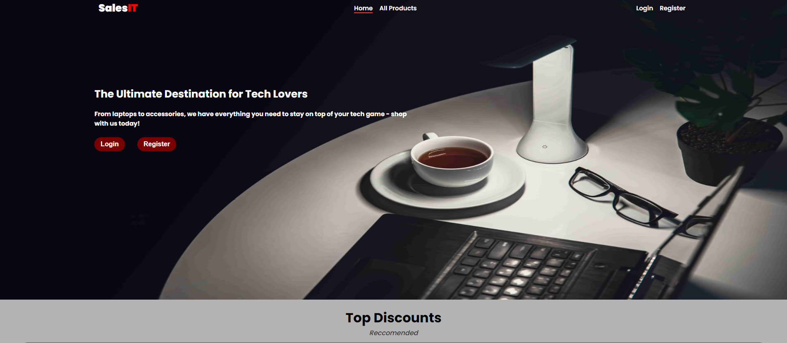

# SalesIT
Sales app made for educational purpose, created with React as Front-End, Node.js as Back-End and MongoDB as database.

<p align="center">
  
</p>
 
## General information
* The main purpose of the app is to view/add products for sale.
* Guests are only able to see Home Page, All Products and Product Details.
* Logged in users have access to Add Product, Shopping Card and Profile information, as well they have the ability to Edit/Delete their own products.

## Technologies 
* Client
    * React: 18.2.0
* Server
    * Node: 18.12.0
    * ExpressJS: 4.18.2
    * bcrypt: 5.1.0
    * cors: 2.8.5
    * dotenv: 16.0.3
    * jsonwebtoken: 8.5.1,
    * mongoose: 6.7.3,
    * nodemon: 2.0.20

## Setup
To run this project, in the project directory, you should run:

```
$ cd ./client
$ npm install
$ npm start
```
Which opens the app at http://localhost:3000 in your browser.
However it will not work until you don't start the RESTful API server.
To start the server you have to be in the project directory and do the following steps:

```
$ cd ./server
$ npm install
$ npm start
```

And the server will start listening on port 8080.

### Browser
* The application is currently deployed in Google Cloud.
    * You can find it on https://salesit-fe.ew.r.appspot.com/

### Tests
* The application have unit tests for the following components: Login, Register
* To run the tests: 
```
$ cd ./client
$ npm test
```